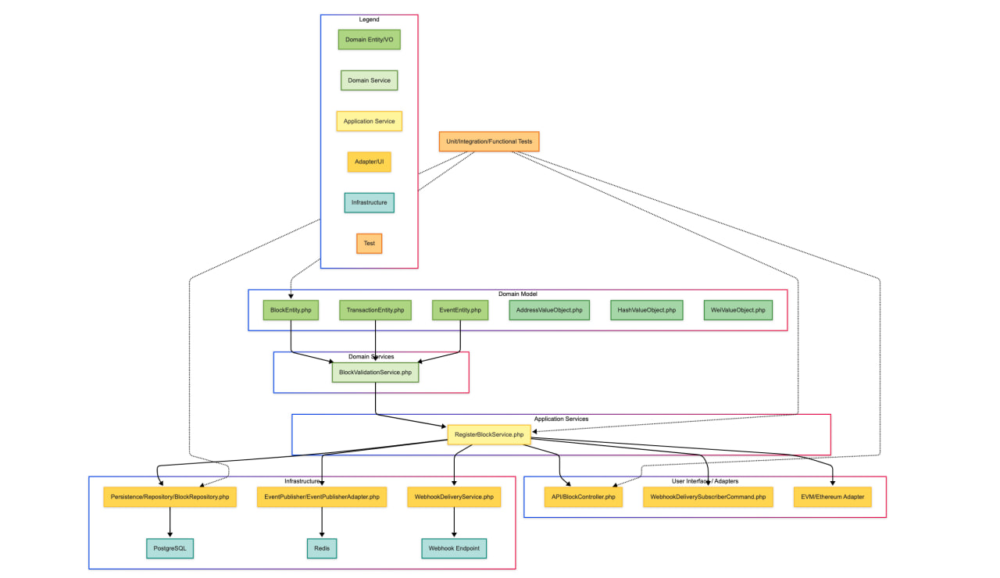
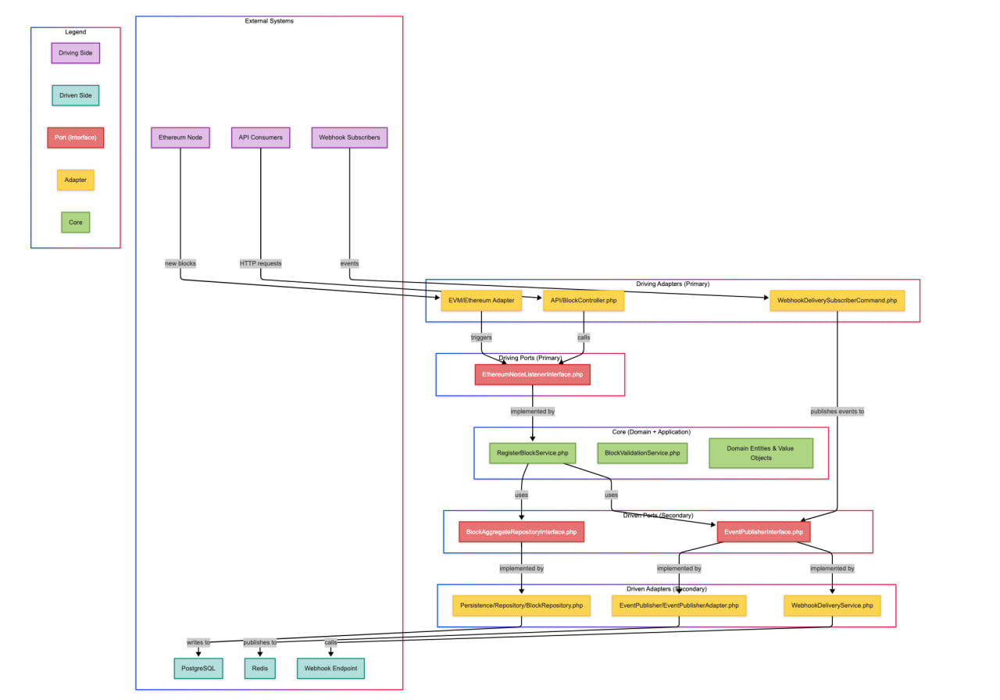
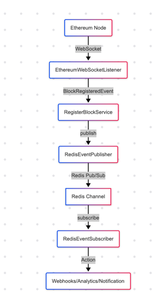

# Web3PulseApp

A monitoring and event-processing application for Web3 ecosystems, built with DDD (Domain-Driven Design) and Hexagonal Architecture principles.

## Project Overview

Web3PulseApp is an MVP that demonstrates modern PHP application architecture patterns by implementing a Web3 blockchain monitoring system. The application connects to Ethereum nodes, monitors blockchain events, and processes them according to business rules with the ability to distribute these events via webhooks.

### Key Features

- **Real-time Blockchain Monitoring**: Connect to Ethereum nodes via WebSocket to track blockchain events
- **Event-Driven Architecture**: Process and distribute events using Redis Pub/Sub
- **Webhook Delivery System**: Forward events to external systems through configurable webhooks
- **Clean Architecture**: Implementation follows DDD and Hexagonal Architecture principles
- **Dual Deployment Options**: Run with either Docker Compose or Kubernetes (minikube locally)
- **Production-Ready Infrastructure**: Includes complete K8s configuration for production deployment

## Architecture

### Domain-Driven Design (DDD)

The project implements DDD principles to model the complex domain of blockchain monitoring:

- **Domain Layer**: Core entities, aggregates, and business rules isolated from infrastructure
- **Application Layer**: Orchestrates the use cases by connecting domain logic to infrastructure
- **Infrastructure Layer**: Provides technical capabilities (database, messaging, API clients)
- **Interfaces Layer**: Entry points to the application, including API controllers and CLI commands



### Hexagonal Architecture (Ports & Adapters)

The hexagonal architecture keeps the application core independent of external concerns:

- **Ports**: Interfaces that define how the application core interacts with the outside world
- **Adapters**: Implementations that connect external systems to these ports
- **Application Core**: Contains all business logic, completely isolated from implementation details



### Event Flow via Redis Pub/Sub

The application uses Redis Pub/Sub for event distribution:

1. Ethereum events are captured via WebSocket connection
2. These events are processed by the application services
3. Processed events are published to Redis channels
4. Dedicated consumers (like the webhook subscriber) pick up events and distribute them

For detailed information about the Pub/Sub implementation, see [README_PUBSUB.md](README_PUBSUB.md).



## Technical Stack

- **Framework**: Symfony 6.4
- **Language**: PHP 8.3
- **Database**: PostgreSQL 14
- **Messaging**: Redis
- **Container**: Docker
- **Orchestration**: Kubernetes (minikube for local development)
- **Testing**: PHPUnit

## Prerequisites

- Docker and Docker Compose
- Minikube (for K8s deployment)
- kubectl
- [Task](https://taskfile.dev/) task runner

## Setup Instructions

### Option 1: Kubernetes Setup (Recommended)

1. Clone the repository:
   ```bash
   git clone https://github.com/IlyaTsokalo/web3pulse-private.git
   cd web3pulse-private
   ```

2. Start Minikube:
   ```bash
   minikube start
   ```

3. Run the complete setup task:
   ```bash
   task k8s:setup
   ```
   This will:
   - Clean any existing resources
   - Build the Docker image
   - Create the Kubernetes namespace
   - Mount the local project directory into Minikube
   - Apply all Kubernetes configurations
   - Wait for PostgreSQL to be ready

4. Run tests to verify the setup:
   ```bash
   task k8s:run-tests
   ```

5. Access the application at:
   ```bash
   minikube service web3pulse-app-service -n web3pulse
   ```
   This command will automatically open your browser with the correct URL.

### Option 2: Docker Compose Setup (Less preferable, involves more manual steps)

1. Clone the repository:
   ```bash
   git clone https://github.com/IlyaTsokalo/web3pulse-private.git
   cd web3pulse-private
   ```

2. Copy the environment variables file:
   ```bash
   cp .env.dev .env
   ```

3. Build and start the containers:
   ```bash
   docker-compose up -d
   ```

4. Install dependencies:
   ```bash
   docker-compose exec app composer install
   ```

5. Run database migrations:
   ```bash
   docker-compose exec app php bin/console doctrine:migrations:migrate
   ```

6. Access the application at http://localhost:8080

## Running Tests

### With Kubernetes:
```bash
task k8s:run-tests
```

### With Docker:
```bash
docker-compose exec app bin/phpunit
```

## Development Workflow

The project uses Task for managing common operations:

```bash
# List available tasks
task -l

# Run code style fixes
task code-style-fix

# Start up K8s environment
task k8s:setup

# Run tests in Kubernetes
task k8s:run-tests

# Get a shell in the app container
task k8s:shell
```

## Project Structure

```
web3-pulse-app/
├── config/                  # Symfony configuration files
├── docker/                  # Docker configuration
├── k8s/                     # Kubernetes manifests
│   ├── configmaps/          # ConfigMaps for app configuration
│   ├── deployments/         # Deployments for each component
│   ├── pvc/                 # Persistent Volume Claims
│   ├── secrets/             # Secret definitions (credentials)
│   └── services/            # Service definitions
├── public/                  # Public web files
├── src/                     # Application source code
│   ├── Application/         # Application services and ports
│   │   └── Port/            # Interfaces defining ports
│   ├── Domain/              # Domain entities and logic
│   ├── Infrastructure/      # External adapters and implementations
│   │   ├── Ethereum/        # Ethereum-specific adapters
│   │   ├── EventPublisher/  # Event publishing implementations
│   │   └── Webhook/         # Webhook delivery system
│   └── UI/                  # User interfaces (controllers, CLI)
├── tests/                   # Automated tests
├── Taskfile.yml             # Task runner definition file
└── README.md                # This file
